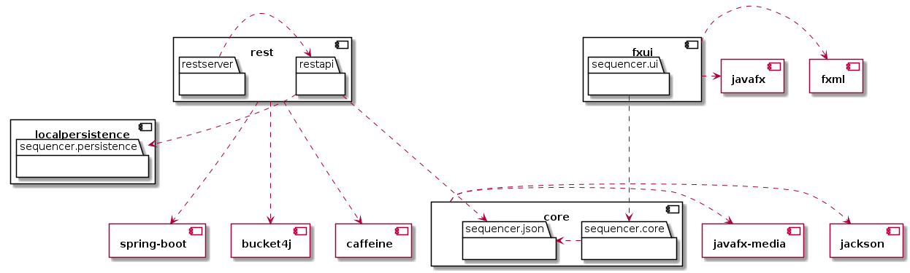
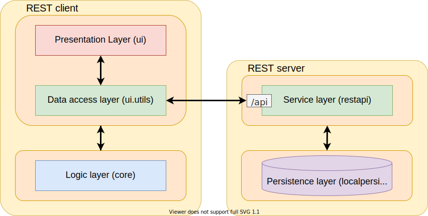

> Everything related to the third release of the application
>>>>>>> Related to #73. Add logo to docs
## Stricter naming policy

It was decided to enforce a stricter naming policy to improve the overall reading experience of the Git history. Gitlab let's you [interact with the Git history](https://gitlab.stud.idi.ntnu.no/it1901/groups-2021/gr2101/gr2101/-/network/main) in a trouble-free way, but we imagine adding a issue number to each commit message will make it easier to keep track of it all.

Branch names must reflect its related issue. This is done by naming it _issue-n-description_, where _n_ is the issue number. Furthermore, the _description_ employs the naming convention ["kebab case"](https://en.wiktionary.org/wiki/kebab_case). For example; _issue-69-review-persistence-feedback_.

Every commit must include a message identifying the changes made. This is to be written in the [imperative mood](https://en.wikipedia.org/wiki/Imperative_mood), e.g. "Add this" or "Fix that". A rule of thumb is to make sure you can say "With this commit, ..." before the message. It must also include the issue number it is related to. An example of a valid commit message would be; _Related to #69. Improve and secure features in PersistenceHandler_.

The title of both the merge request and issue also follow the same grammatical tense as the commit message, imperative mood. The only exeption to this are issues labled with _bug_, in which the task of the title is only to state the bug itself and not what to be done.

We decided to put this information in the [root readme](../), so to make it easily accessible to anyone interested in contributing to the project.

## Project overview

The project has now moved from a monolithic structure to a using a REST client and server. Both client and server are again divided into different *layers*, represented by the following modules:

#### Client | *presentation-layer* and *data-access-layer* : fxui

Essential module responsible for rendering all graphics within the application. The module is using `javafx` to render in a window, and delegating all logic regarding playing/editing tracks to the **core** module, and storage to classes in the ui.util-package.

---

#### Client | *logic-layer* : core

Detachable module which is handling all logic essential to the sequencer. Audio is currently played through `javafx-media`, and all important class-info can be serialized to a json-format through the `jackson` dependency.

---

#### Server | *service-layer* : rest

Essential module serving as the REST server. The module uses `spring-boot` to service all http requests, running as a servlet with `tomcat`. Rate limiting is achieved with `bucket4j`, storing ip-adressses in-memory with `caffeine`. All persistence logic is delegated to the **localpersistence** module.


#### Server | *persistence-layer* : localpersistence

Detachable module which is handling local storage of classes. The modules save-handling is tailored to the project: The methods avaliable allows the user to list all files with a given filetype from a directory in `$HOME` (e.g. a `.json` file in the `$HOME/drumsequencer` directory), and read from/write to these files. The saving is implicit, and the user is not expected to handle the files. The serialization must be handled by whoever is handling the `Reader`/`Writer`.

---

This has introduced a new module, **rest**. It is responsible for running the REST server, capable of storing, loading and listing tracks over http. More details about the new module is in the [sections further down](#spring-boot-as-a-web-service).

This means the package-diagram has received additional changes. The old diagram is still applicable when using `LocalTrackAccess` as the access class, but we have added a second diagram below illustrating dependencies with `RemoteTrackAccess`, which is utilizing the **rest** module for storing tracks:




Notice how **localpersistence** is now used by restapi instead of sequencer.json, as it is the backend which is now storing objects. These modules/packages are communicating with each other in a manner shown in the diagram below.
<div align="center">
</img>
</div>

<!--
```plantuml
skinparam BackgroundColor transparent
skinparam ComponentFontStyle bold
skinparam PackageFontStyle plain

component fxui {
 package sequencer.ui {
 }
}
component core {
    package sequencer.core {}
    package sequencer.json {}
}
component localpersistence {
    package sequencer.persistence {}
}

component rest {

    package restapi {}
    package restserver {}
}

component javafx {
}
component fxml {
}
component "javafx-media" {
}
component jackson {
}

component "spring-boot" {
}
component bucket4j {
}
component caffeine {
}

sequencer.ui ...> sequencer.core
sequencer.core .right.> sequencer.json

fxui .left.> javafx
fxui .left.> fxml

rest ...> "spring-boot"
rest ...> bucket4j
rest ...> caffeine

restserver .right.> restapi
restapi .down.> sequencer.persistence
restapi ...> sequencer.json

core .right.> "javafx-media"
core .right.> jackson
```
-->


## Spring Boot as a web service

We previously mentioned accessing storage through a REST-api. This has been achieved with [Spring](https://spring.io/), a popular [IoC](https://www.baeldung.com/inversion-control-and-dependency-injection-in-spring)-based framework to create such services.

The framework itself uses similar programming concepts as [Jakarta](https://en.wikipedia.org/wiki/Jakarta_RESTful_Web_Services), i.e. creating independent services which can be injected and managed by a main application. Spring itself is packaged in an additional layer of logic to run the project as a web service, called [Spring Boot](https://spring.io/projects/spring-boot). This has allowed us to focus on writing the REST-logic of our application, while [Tomcat](http://tomcat.apache.org/) and other dependecies are configured to the expected standards. Spring boot also supports strong REST-enforcement with their preconfigured controllers, adding and additional layer of code quality checks when writing the application.

## REST API

When creating the API, it became important to us to follow the REST standards employed in a real work setting. We have therefore read a few sources about how to best acheive a RESTful api:
- [Red Hat, What is REST API?](https://www.redhat.com/en/topics/api/what-is-a-rest-api)
- [Vinay Sahni, Best Practices for Designing a Pragmatic RESTful API](https://www.vinaysahni.com/best-practices-for-a-pragmatic-restful-api#useful-post-responses)

The REST API is hosted on port 8080 with endpoints starting with `/api/`. The endpoints as of this release are:

### Get all track names

GET `/api/tracks?name={name}&artist={artist}`

Returns: A list of all tracks, with id, name, artist and timestamp. Use the search queries "name" and "artist" to filter the results to songs that match the queries.

Example:

```json
[
  {
    "id": "1",
    "name": "Im in love with Jacoco",
    "artist": "Michael Jackson",
    "timestamp": 0
  },
  {
    "id": "2",
    "name": "Here comes JSON",
    "artist": "the megabitles",
    "timestamp": 0
  },
  {
    "id": "3",
    "name": "The Lazy JSONg",
    "artist": "Brown Marsh",
    "timestamp": 0
  },
  {
    "id": "4",
    "name": "Tougher than the REST",
    "artist": "John Doe and The Placeholders",
    "timestamp": 0
  }
]
```

### Get a specific track

GET `api/tracks/{id}`

Returns: The data of the track with the given ID

Example:

GET `api/tracks/5`

```json
{
  "name": "Example song",
  "artist": "JSON Mraz",
  "instruments": {
    "hihat": [
      true, true, true, true, true, true, true, true, true, true, true, true, true, true, true, true
    ],
    "kick": [
      true, false, false, false, true, false, false, false, true, false, false, false, true, false, false, false
    ]
  }
}
```

### Post a new track

POST `api/tracks`

Returns: Body of the posted track with their id if it was sucessful, as per REST-standards. The body of the request must be of type `application/json` with the format described at [File format for tracks](#file-format-for-tracks).

Example:

POST `api/tracks`

Body:

```json
Content-Type: application/json
{
  "name": "postedTrack",
  "artist": "POST Malone",
  "instruments" : {
    "hihat": [
      true, true, true, true, true, true, true, true, true, true, true, true, true, true, true, true
    ],
    "kick": [
      true, false, false, false, true, false, false, false, true, false, false, false, true, false, false, false
    ]
  }
}
```

Response:

```json
Content-Type: application/json
Location: localhost:8080/api/tracks/{id} /* Assuming server is running at localhost:8080 */
{
  "name": "postedTrack",
  "artist": "POST Malone",
  "instruments" : {
    "hihat": [
      true, true, true, true, true, true, true, true, true, true, true, true, true, true, true, true
    ],
    "kick": [
      true, false, false, false, true, false, false, false, true, false, false, false, true, false, false, false
    ]
  }
}
```

### Preserve server with rate limiting

Our application is very accessible when it comes to sharing tracks. Tracks are available to anyone familiar with our API, and any track in a valid format will be stored. This also means anyone can post to our server, and can run into the risk of getting a high server load, or other similar server attacks.

There are several solutions to mitigate this, such as requiring authentication, end-to-end encryption and other security implementations. Many of these will dampen our problem, but also challenge our users with security-checks which will likely appear meaningless, as authentication (intentionally) does not change how the application behaves.

Track information contains no user-sensitive data (see examples of post-requests), which means our greatest concern is server load. A satisfying solution to this is to use IP-based rate limiting, which is implemented with [Bucket4j](https://github.com/MarcGiffing/bucket4j-spring-boot-starter#bucket4j_complete_properties). Our implementation can also easily be changed to be user-based, if this is something we wish to use later.

IP-based limiting requires somewhere to store the IP-addresses and their respective [buckets](https://en.wikipedia.org/wiki/Token_bucket). There's no reason to store this long-term, though a high access time is crucial to maintain a high server performance. This is why we store it with in-memory cache, which is achieved with [caffeine](https://github.com/ben-manes/caffeine).
