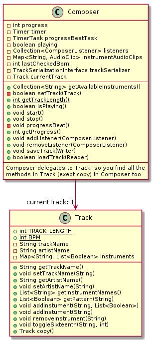

Drum sequencer is an application which lets users quickly create, edit and save short drum tracks. The app is meant to be an accesible solution for people who want to make short tracks on the go. The final product aims to let users save their work to a common database, from which everyone can access and use as inspiration in their beat-making journey.

## Project overview

Project is currently divided into a REST client and server. Both client and server are again divided into different *layers*, represented by the following modules:

#### Client | *presentation-layer* and *data-access-layer* : fxui

Essential module responsible for rendering all graphics within the application. The module is using `javafx` to render in a window, and delegating all logic playing/editing beats to the **core** module, and storage to classes in the ui.util-package.

---

#### Client | *logic-layer* : core

Detachable module which is handling all logic essential to the sequencer. Audio is currently played through `javafx-media`, and all important class-info can be serialized to a json-format through the `jackson` dependency. The two most essential classes in this module is the `Composer` and `Track`, which interact with eachother in the following way:



---

#### Server | *service-layer* : rest

Essential module serving as the REST server. The module uses `spring-boot` to service all http requests, running as a servlet with `tomcat`. Rate limiting is achieved with `bucket4j`, storing ip-adressses in-memory with `caffeine`. All persistence logic is delegated to the **localpersistence** module.


#### Server | *persistence-layer* : localpersistence

Detachable module which is handling local storage of classes. The modules save-handling is tailored to the project: The methods avaliable allows the user to list all files with a given filetype from a directory in `$HOME` (e.g. a `.json` file in the `$HOME/drumsequencer` directory), and read from/write to these files. The saving is implicit, and the user is not expected to handle the files. The serialization must be handled by whoever is handling the `Reader`/`Writer`.

---

Below is a package diagram showing what dependecies each module has:


Notice how **localpersistence** is used by restapi instead of sequencer.json. These modules/packages are communicating with each other in a manner shown in the diagram below.

<div align="center">
</img>
</div>

## File format for Tracks

The Track-files follow JSON-formatting. The following is an example of a file:

```json
{
  "name": "Example song",
  "artist": "JSON Mraz",
  "instruments": {
    "hihat": [
      true, true, true, true, true, true, true, true, true, true, true, true, true, true, true, true
    ],
    "kick": [
      true, false, false, false, true, false, false, false, true, false, false, false, true, false, false, false
    ]
  }
}
```

The root contains three nodes, "`name`", "`artist`" and "`instruments`". The "`name`" and "`artist`" nodes are text nodes containing the name of the song and the artist. The "`instruments`" node is an object node, where the key of each node is an instrument and the value is a boolean list describing which sixteenths they are playing on.

## REST API

The REST API is hosted on port 8080 with endpoints starting with `/api/`. The current endpoints are:

### Get all track names

GET `/api/tracks?name={name}&artist={artist}`

Returns: A list of all tracks, with id, name, artist and timestamp. Use the search queries "name" and "artist" to filter the results to songs that match the queries.

Example:

```json
[
  {
    "id": "1",
    "name": "Im in love with Jacoco",
    "artist": "Michael Jackson",
    "timestamp": 0
  },
  {
    "id": "2",
    "name": "Here comes JSON",
    "artist": "the megabitles",
    "timestamp": 0
  },
  {
    "id": "3",
    "name": "The Lazy JSONg",
    "artist": "Brown Marsh",
    "timestamp": 0
  },
  {
    "id": "4",
    "name": "Tougher than the REST",
    "artist": "John Doe and The Placeholders",
    "timestamp": 0
  }
]
```

### Get a specific track

GET `api/tracks/{id}`

Returns: The data of the track with the given ID

Example:

GET `api/tracks/5`

```json
{
  "name": "Example song",
  "artist": "JSON Mraz",
  "instruments": {
    "hihat": [
      true, true, true, true, true, true, true, true, true, true, true, true, true, true, true, true
    ],
    "kick": [
      true, false, false, false, true, false, false, false, true, false, false, false, true, false, false, false
    ]
  }
}
```

### Post a new track

POST `api/tracks`

Returns: Body of the posted track with their id if it was sucessful, as per REST-standards. The body of the request must be of type `application/json` with the format described at [File format for tracks](#file-format-for-tracks).

Example:

POST `api/tracks`

Body:

```json
Content-Type: application/json
{
  "name": "postedTrack",
  "artist": "POST Malone",
  "instruments" : {
    "hihat": [
      true, true, true, true, true, true, true, true, true, true, true, true, true, true, true, true
    ],
    "kick": [
      true, false, false, false, true, false, false, false, true, false, false, false, true, false, false, false
    ]
  }
}
```

Response:

```json
Content-Type: application/json
Location: localhost:8080/api/tracks/{id} /* Assuming server is running at localhost:8080 */
{
  "name": "postedTrack",
  "artist": "POST Malone",
  "instruments" : {
    "hihat": [
      true, true, true, true, true, true, true, true, true, true, true, true, true, true, true, true
    ],
    "kick": [
      true, false, false, false, true, false, false, false, true, false, false, false, true, false, false, false
    ]
  }
}
```

## Rate limiting based on IP-address

Our application uses rate limiting to prevent overloading our server, achieved with [Bucket4j](https://github.com/MarcGiffing/bucket4j-spring-boot-starter). Limiting is based on both the current load on the server and IP-addresses. We use [caffeine](https://github.com/ben-manes/caffeine) to create in-memory cache where we can store our [buckets](https://en.wikipedia.org/wiki/Token_bucket), meaning the server can maintain high performance while handling all the tokens.

Read more about our choice of implementation in the [release docs](./../docs/release3)

## Test-classes

- Composer: [`core/src/test/java/sequencer/core/ComposerTest.java`](./core/src/test/java/sequencer/core/ComposerTest.java)
- Track: [`core/src/test/java/sequencer/core/TrackTest.java`](./core/src/test/java/sequencer/core/TrackTest.java)

- TrackMapper: [`core/src/test/java/sequencer/json/TrackMapperTest.java`](./core/src/test/java/sequencer/json/TrackMapperTest.java)

- SequencerController: [`fxui/src/test/java/sequencer/ui/SequencerControllerTest.java`](./fxui/src/test/java/sequencer/ui/SequencerControllerTest.java)

- PersistenceHandler: [`localpersistence/src/test/java/sequencer/persistence/PersistenceHandlerTest.java`](./localpersistence/src/test/java/sequencer/persistence/PersistenceHandlerTest.java)

- SequencerRestController (Unit): [`rest/src/test/java/restapi/SequencerRestControllerTest.java`](rest/src/test/java/restapi/SequencerRestControllerTest.java)
- SequencerServerApplication (Integration): [`rest/src/test/java/restserver/SequencerServerApplication.java`](rest/src/test/java/restserver/SequencerServerApplicationTest.java)


## User-stories

All above-mentioned featues are based on the [user-stories](./../brukerhistorier.md) (norwegian)
