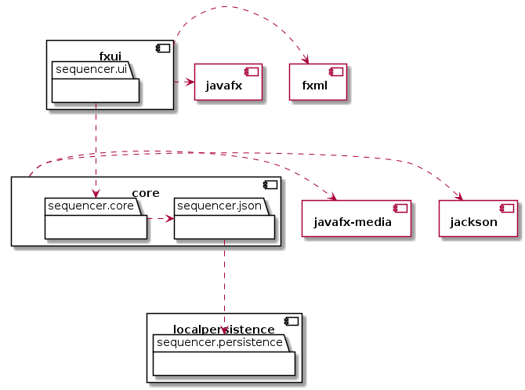

# Drum sequencer 📾

Drum sequencer is an application which lets users quickly create, edit and save short drum tracks. The app is meant to be an accesible solution for people who want to make short tracks on the go. The final product aims to let users save their work to a common database, from which everyone can access and use as inspiration in their beat-making journey.

## Project overview

Project is currently in a monolithic architecture, divided into three *layers*. Each layer is represented by the following modules:

#### *presentation-layer* : fxui

Essential module responsible for rendering all graphics within the application. The module is using `javafx` to render in a window, and delegating all logic to the **core** module, and storage to the **localpersistence** module.

---

#### *application-layer* : core

Detachable module which is handling all logic essential to the sequencer. Audio is currently played through `javafx-media`, and all important class-info can be serialized to a json-format through the `jackson` dependency.

---

#### *persistence-layer* : localpersistence

Detachable module which is handling local storage of classes. The modules save-handling is tailored to the project: The methods avaliable allows the user to list all files with a given filetype from a directory (e.g. a `.json` file in the `~/drumsequencer` directory), and read from/write to a specific file. The saving is implicit, and the user is not expected to handle the files. The serialization must be handled by whoever is handling the `Reader`.

---



## File format for Tracks

The Track-files follow JSON-formatting. The following is an example of a file:

```json
{
    "name": "Example song",
    "artist": "JSON Mraz",
    "instruments" : {
        "hihat": [True, True, True, True, True, True, True, True, True, True, True, True, True, True, True, True],
        "kick": [True, False, False, False, True, False, False, False, True, False, False, False, True, False, False, False]
    }
}
```

The root contains three nodes, "`name`", "`artist`" and "`instruments`". The "`name`" and "`artist`" nodes are text nodes containing the name of the song and the artist. The "`instruments`" node is an object node, where the key of each node is an instrument and the value is a boolean list describing which sixteenths they are playing on.

## Test-classes

- TrackMapper: [`core/src/test/java/sequencer/json/TrackMapperTest.java`](./core/src/test/java/sequencer/json/TrackMapperTest.java)
- PersistenceHandler: [`localpersistence/src/test/java/sequencer/persistence/PersistenceHandlerTest.java`](./localpersistence/src/test/java/sequencer/persistence/PersistenceHandlerTest.java)
- Composer [`core/src/test/java/sequencer/core/ComposerTest.java`](./core/src/test/java/sequencer/core/ComposerTest.java)

## User-stories

All above-mentioned featues are based on the [user-stories](./../brukerhistorier.md) (norwegian)
